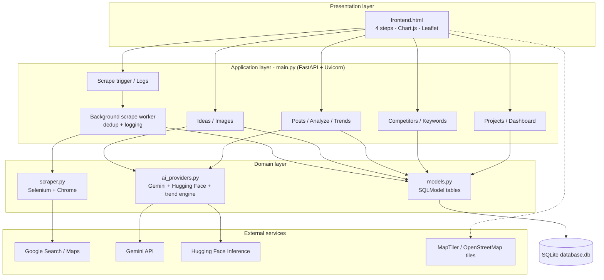

# Competitor Radar

**Google Maps Competitor Update Intelligence Tool**

Competitor Radar collects the **Google Maps Updates** (posts) that competitor businesses publish, stores them in a local repository without duplicates, analyses them with AI, shows which topics are trending across competitors, and generates complete Google Maps update drafts (copy, call to action, keywords, image concept and an AI image) for your own business.

---

## Table of contents

1. [Features](#features)
2. [How it works](#how-it-works)
3. [Architecture](#architecture)
4. [Tech stack](#tech-stack)
5. [Project structure](#project-structure)
6. [Setup and run](#setup-and-run)
7. [Configuration (.env)](#configuration-env)
8. [Using the app](#using-the-app)
9. [CAPTCHA handling](#captcha-handling)
10. [REST API reference](#rest-api-reference)
11. [Data model](#data-model)
12. [AI providers and failure recovery](#ai-providers-and-failure-recovery)
13. [Deployment notes](#deployment-notes)
14. [Troubleshooting](#troubleshooting)
15. [Known limitations](#known-limitations)
16. [License](#license)

---

## Features

| Area | What you get |
|---|---|
| Projects | One workspace per client: your business, competitors, keywords, ideas |
| Competitors | Search Google Maps, pick the right branch on a map, add / edit / delete, re-scrape, see last status and post count |
| Scraping | Selenium + Chrome reads each competitor's Updates: text, title, validity, date, CTA, image/video link, share URL |
| Duplicates | Hash + Google post id + field comparison + a UNIQUE DB index; re-scrapes stop after 3 known posts in a row |
| CAPTCHA | Detected, never silent; Manually solve it in the Chrome window and scraping resumes automatically; timeouts are logged |
| Repository | Search and filter posts by competitor, topic, keyword, text and date; view images and source links; scrape history |
| AI analysis | Topic, sub-topic, content type, offer pattern, call to action, keywords (one structured Gemini call) |
| Trends | % of tracked rivals using each topic, recency-weighted, bar chart plus plain-English AI explanation (Hugging Face) |
| Ideas | Generate exactly N ideas (60% trend remixes, 40% fresh), tied to upcoming festivals and your focus keywords |
| Images | AI image per idea (Hugging Face FLUX.1-schnell), stored in the database, downloadable |
| No repeats | Earlier ideas are remembered per project and avoided in later requests |
| Dashboard | Competitors, posts, new posts, duplicates skipped, failures, last scrape, top topics and keywords, idea count |
| Logs | Persistent log per scrape run: times, found / new / duplicates, status, error text |
| Resilience | Gemini model discovery, rotation and cooldown on 503 / 429; stored data survives any failure |

---

## How it works

```
Create project -> add rivals + keywords -> scrape -> store (no duplicates)
      -> AI analysis -> trend table + chart + AI explanation
      -> generate N ideas -> generate image -> review history
```

1. **Scrape.** `POST /competitors/{id}/scrape/` queues a background task and returns at once. The worker creates a `ScrapeLog`, starts Chrome, finds the right branch (name + address), opens *View previous updates on Google*, reads every card, then reads each new card's `share.google` URL.
2. **Deduplicate.** Every post gets a `content_hash` (scoped by competitor id). A post is skipped if the hash, the Google `post_id`, or the same date + title + text + validity already exists. The UNIQUE index on `content_hash` is the last safety net.
3. **Analyse.** Only posts without a topic are sent, all in one Gemini call using a JSON schema.
4. **Trend.** `find_trends()` (plain Python) computes `coverage % = rivals using the topic / tracked rivals` and a recency score `0.5 ^ (age_days / 90)`.
5. **Generate.** One Gemini call returns exactly `count` ideas: about 60% rework the newest posts of the top trending topics into new copy, about 40% are fresh angles. The prompt also receives your business name, focus keywords, festivals in the next 60 days and the topics already used.

---

## Architecture



PNG versions of the architecture, ER diagram and flowcharts are in `diagrams/`.

---

## Tech stack

| Area | Technology |
|---|---|
| Language | Python 3.12 |
| Package manager | [uv](https://docs.astral.sh/uv/) (`pyproject.toml`, `uv.lock`) |
| Web framework | FastAPI + Uvicorn |
| Database / ORM | SQLite + SQLModel |
| Browser automation | Selenium + Google Chrome (driver via `webdriver-manager`) |
| Text AI | Google Gemini (`google-genai`) |
| Second AI provider | Hugging Face Inference (`huggingface_hub`): FLUX.1-schnell images, Qwen / Llama chart explanation |
| Frontend | Single HTML file, vanilla JS, Chart.js, Leaflet + MapTiler tiles |
| Config | `python-dotenv` |

---

## Project structure

```
Competitor-Radar/
├── .env.example          # Template for environment variables (copy to .env)
├── .python-version       # Python version specification (3.12)
├── ai_providers.py       # Gemini + Hugging Face integration, trend engine
├── database.db           # SQLite database (contains the demo dataset)
├── frontend.html         # Single-page web interface (served at "/")
├── LICENSE               # Project license
├── logo.png              # Project branding asset
├── main.py               # FastAPI app: routes, background worker, dedup, dashboard
├── models.py             # SQLModel tables and response models
├── pyproject.toml        # Project dependencies configuration
├── README.md             # Documentation and setup instructions
├── scraper.py            # Selenium Google Maps Updates scraper + CAPTCHA wait loop
└── uv.lock               # Locked dependency versions
```

---

## Setup and run

### Prerequisites

- Python 3.12+
- [uv](https://docs.astral.sh/uv/getting-started/installation/)
- Google Chrome installed (the matching ChromeDriver is downloaded automatically)
- A free Gemini API key and a free Hugging Face access token

### Steps

```bash
# 1. Get the code
git clone https://github.com/Parth050812/Competitor-Radar.git
cd Competitor-Radar

# 2. Install dependencies from the lock file
uv sync

# 3. Add your keys
cp .env.example .env        # Windows: copy .env.example .env
# then edit .env and set GEMINI_API_KEY and HF_TOKEN

# 4. Run
uv run uvicorn main:app --reload
```

Open:

- App: <http://127.0.0.1:8000>
- Interactive API docs: <http://127.0.0.1:8000/docs>

On first start the app creates missing tables and adds any missing columns to `database.db`, so the bundled demo database works as is. Delete `database.db` to start empty.

> **No uv?** Install the packages from `pyproject.toml` with `pip` in a Python 3.12 virtual environment, then run `uvicorn main:app --reload`.

---

## Configuration (.env)

Keys stay on the server. They are never sent to the browser.

| Variable | Purpose | Default |
|---|---|---|
| `GEMINI_API_KEY` (or `GOOGLE_API_KEY`) | Gemini access (analysis, ideas) | required |
|`MAP_KEY`|MapTiler / OpenStreetMap tiles for map visualization|required|
| `HF_TOKEN` | Hugging Face token (images, chart explanation) | required for those features |
| `HF_IMAGE_MODEL` | Image model | `black-forest-labs/FLUX.1-schnell` |
| `HF_EXPLAIN_MODELS` | Ordered models for the chart explanation | Qwen2.5-72B, Llama-3.1-8B, Qwen2.5-7B |

---

## Using the app

The interface has four guided steps.

1. **Find rivals** - create a project (name + your business name). Search Google Maps for a competitor, check the pins on the map, press *Add as rival*. Add focus keywords. Press **Get their posts** on a rival to scrape it.
2. **Read their posts** - browse posts with images and source links; filter by competitor, topic, keyword or text. Press **Analyze all posts with AI**.
3. **Spot trends** - bar chart of how many rivals use each topic, with an AI explanation (use *Regenerate* for a fresh one).
4. **Get ideas** - choose how many ideas, press **Generate post ideas**, then **Generate Image** and download. Earlier ideas stay in the history and are avoided next time.

Tip: scrape the same rival twice. The second run should report `new posts = 0` and duplicates skipped.

---

## CAPTCHA handling

Google may show a verification screen during a scrape.

1. The scraper detects it (reCAPTCHA frame, captcha form, "unusual traffic" text) and pauses with a clear message.
2. The Chrome window is visible by default (`HEADLESS=false`). **Solve the verification in that window.**
3. The scraper polls every 2 seconds and **continues automatically** once the screen is gone.
4. If nothing is solved within 180 seconds, the run stops. The log and the rival get the status `captcha_blocked`, the UI shows *Google blocked this run, try again later*, and posts already collected are kept.

Live scraping therefore runs on a machine with Chrome and a desktop session. A hosted copy uses the stored demo repository. No automatic CAPTCHA solver is used.

---

## REST API reference

All request and response bodies are JSON. Interactive docs: `/docs` (Swagger UI) and `/redoc`.

### Pages

| Method | Path | Use |
|---|---|---|
| GET | `/` | Web interface |
| GET | `/logo.png` | Logo / favicon |

### Projects and dashboard

| Method | Path | Use |
|---|---|---|
| POST | `/projects/` | Create a project. Body: `{"name": "...", "target_business": "..."}` |
| GET | `/projects/` | List projects |
| GET | `/projects/{project_id}/dashboard` | Statistics: `competitor_count`, `total_posts`, `analyzed_posts`, `unanalyzed_posts`, `generated_idea_count`, `top_topics`, `top_keywords`, `last_scrape`, `new_posts_latest`, `duplicates_skipped_total`, `scrape_failures` |

### Competitors

| Method | Path | Use |
|---|---|---|
| GET | `/competitors/search/?q=cafe+leopold+colaba` | Search Google Maps and return candidates (name, address, `maps_url`, `place_id`). `503` if a CAPTCHA blocks it |
| POST | `/projects/{project_id}/competitors/` | Add the confirmed candidate. Body: `{"name", "maps_url", "place_id", "address"}`. A known `place_id` in the project is returned, not duplicated |
| GET | `/projects/{project_id}/competitors/` | List competitors with `last_scrape_status` and `last_scraped_at` |
| PUT | `/competitors/{competitor_id}` | Edit `name`, `maps_url`, `address` |
| DELETE | `/competitors/{competitor_id}` | Delete the competitor with its posts and logs |

### Keywords

| Method | Path | Use |
|---|---|---|
| POST | `/projects/{project_id}/keywords/` | Add a keyword. Body: `{"text": "gift card"}`. Case-insensitive duplicates are ignored |
| GET | `/projects/{project_id}/keywords/` | List keywords |
| DELETE | `/projects/{project_id}/keywords/{keyword_id}` | Remove a keyword |

### Scraping and logs

| Method | Path | Use |
|---|---|---|
| POST | `/competitors/{competitor_id}/scrape/` | Queue a scrape / re-scrape; returns immediately |
| GET | `/competitors/{competitor_id}/logs/` | Scrape history: `started_at`, `finished_at`, `posts_found`, `new_posts`, `duplicates_skipped`, `up_to_date`, `status`, `error_message` |

`status` is one of `running`, `success`, `no_updates`, `captcha_blocked`, `error`.

### Repository, analysis and trends

| Method | Path | Use |
|---|---|---|
| GET | `/projects/{project_id}/posts/` | Repository search. Optional query: `competitor_id`, `topic`, `q`, `keyword`, `date_from`, `date_to` |
| POST | `/projects/{project_id}/analyze/` | AI analysis of posts not yet analysed. `400` if there are no posts, `503` if AI is busy |
| GET | `/projects/{project_id}/trends/` | Rows of `topic`, `competitors_using`, `total_competitors`, `occurrence_pct`, `post_count`, `recency_score`, `latest_post_date` |
| GET | `/projects/{project_id}/trends/explanation/` | Plain-English chart explanation (Hugging Face). `?refresh=true` skips the cache |

### Ideas and images

| Method | Path | Use |
|---|---|---|
| POST | `/projects/{project_id}/generate-ideas/` | Generate exactly `count` ideas. Body: `{"count": 10}` |
| GET | `/projects/{project_id}/ideas/` | Idea history, newest first, with image availability |
| POST | `/ideas/{idea_id}/generate-image/` | Generate and store an AI image for an idea |
| GET | `/ideas/{idea_id}/image` | Stored image. `?download=true` for an attachment |
| DELETE | `/ideas/{idea_id}` | Delete an idea |


## Data model

| Table | Main fields |
|---|---|
| Project | `name`, `target_business`, `created_at` |
| Keyword | `project_id`, `text` |
| Competitor | `project_id`, `name`, `maps_url`, `place_id`, `address`, `last_scraped_at`, `last_scrape_status` |
| ScrapedPost | `competitor_id`, `content`, `title`, `validity`, `published_date`, `post_url`, `post_id`, `image_url`, `video_url`, `cta_text`, AI fields (`topic`, `sub_topic`, `content_type`, `offer_pattern`, `analysis_cta`, `keywords_detected`), `content_hash` (UNIQUE), `scraped_at` |
| ScrapeLog | `competitor_id`, `started_at`, `finished_at`, `posts_found`, `new_posts`, `duplicates_skipped`, `up_to_date`, `status`, `error_message` |
| GeneratedIdea | `project_id`, `topic`, `draft_copy`, `cta_suggested`, `image_concept`, `keywords`, `source_trend`, `strategy_reason`, `image_data`, `image_mime_type`, `image_business_name`, `created_at` |

---

## AI providers and failure recovery

| Provider | Used for |
|---|---|
| Google Gemini | Post analysis (1 call), idea generation (1 call per request) |
| Hugging Face Inference | Idea images (FLUX.1-schnell), Spot Trends explanation (Qwen / Llama) |

Free tiers often return `503` or `429`. The Gemini layer:

- discovers the models your key can use (or honours `GEMINI_MODELS`) and ranks them;
- on 429 / 500 / 502 / 503 / 504 rotates to the next model immediately and cools the failed one down;
- asks for JSON that matches a schema and validates it before use;
- returns a friendly `503` to the UI if every model fails, leaving stored data untouched.

The chart explanation tries several Hugging Face models in order and caches the answer by a fingerprint of the trend data.

---

## Deployment notes

```bash
uv sync
uv run uvicorn main:app --host 0.0.0.0 --port 8000
```

- FastAPI serves the UI at `/`, so one service is enough; no separate frontend host or CORS setup.
- Set `GEMINI_API_KEY` and `HF_TOKEN` as environment variables on the host (or a `.env` file that is not in the repository).
- SQLite writes to `database.db`. On hosts with an ephemeral disk, changes made online can be lost on redeploy; the bundled database restores the demo dataset.
- Live scraping needs Chrome and, for CAPTCHA, a visible desktop session. On a server use the stored repository, or `HEADLESS=true` when you accept that a CAPTCHA cannot be solved.
- The interface has no login by design, so it can be reviewed without credentials.

---

## Troubleshooting

| Problem | What to try |
|---|---|
| `AI is busy right now` (503) | Wait a minute; the app already rotates models. Check `GEMINI_API_KEY` |
| Chart explanation fails | Set `HF_TOKEN`; try other `HF_EXPLAIN_MODELS` |
| Image generation fails | Set `HF_TOKEN`; try another `HF_IMAGE_MODEL` or `HF_IMAGE_PROVIDER` |
| `Google blocked this run` | Solve the CAPTCHA within 180 s next time; try later |
| Competitor shows `no_updates` | That business has not posted any Google updates |
| Chrome does not start | Install Chrome; check internet access for the driver download |
| Map is blank | Replace `MAP_KEY` in `frontend.html` with your own MapTiler key |

---

## Known limitations

- CAPTCHA needs a human and a visible Chrome window on the machine that runs the backend; there is no automatic solver.
- All pending posts are analysed in one AI call; very large first runs may need a second press of *Analyze*.
- Idea de-duplication is prompt-based plus stored history, not embedding similarity.
- Google can change its page structure, which may require selector updates. Use responsibly and respect Google's terms.
- The hugging face image generation model are weak might generate AI disfigured images sometimes 

## License

See [LICENSE](LICENSE).